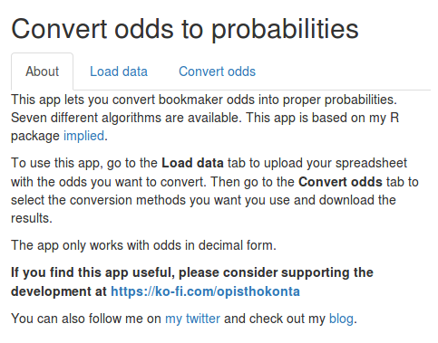
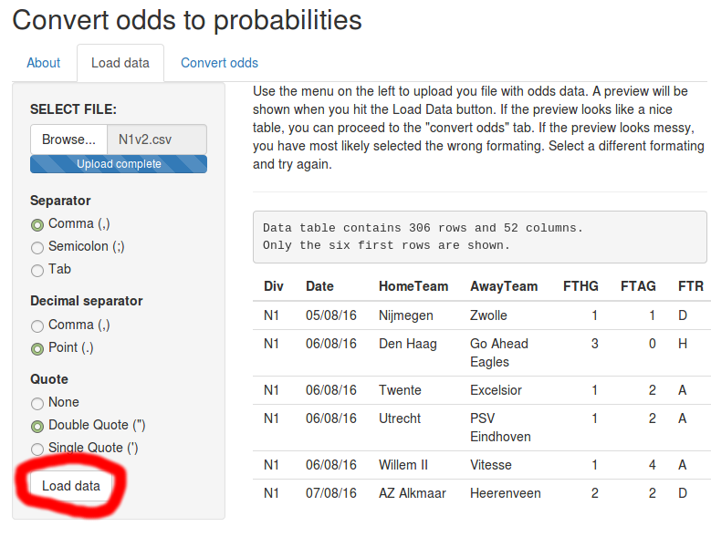
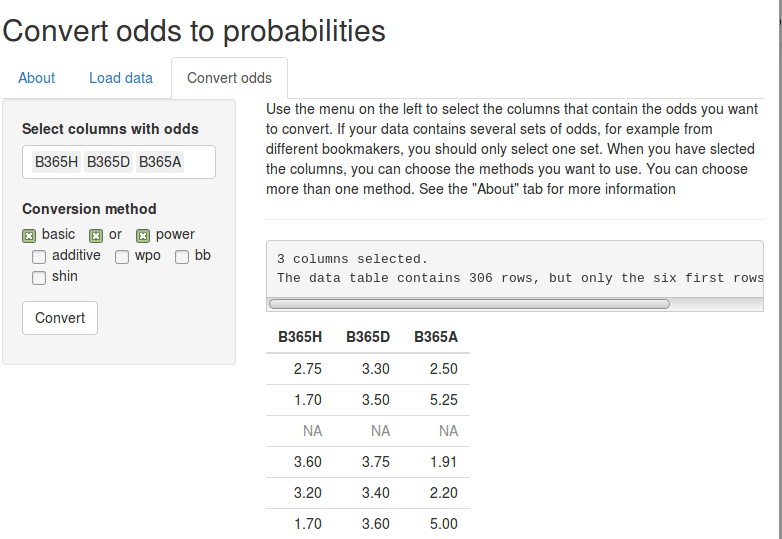
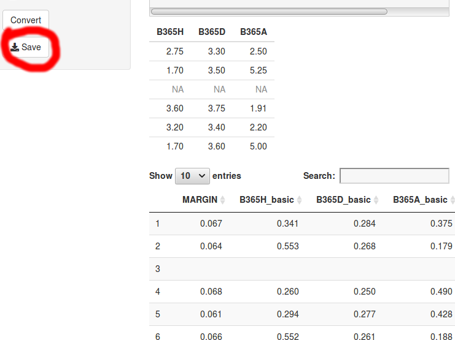

<!-- README.md is generated from README.Rmd. Please edit that file -->
This package provied a graphical user interface (GUI) for the [implied](https://cran.r-project.org/web/packages/implied/index.html) package. The goal is to make it easier to convert bookmaker odds to proper probabilities.

The app only works with odds in decimal form.

If you find this app useful, please consider supporting the development at <https://ko-fi.com/opisthokonta>

Installation
============

``` r
install.packages("devtools")
devtools::install_github("opisthokonta/impliedgui")
```

Use
===

To load the GUI from R, run the following two lines of code:

``` r
library(impliedgui)
impliedGUI()
```

Screenshots
===========


